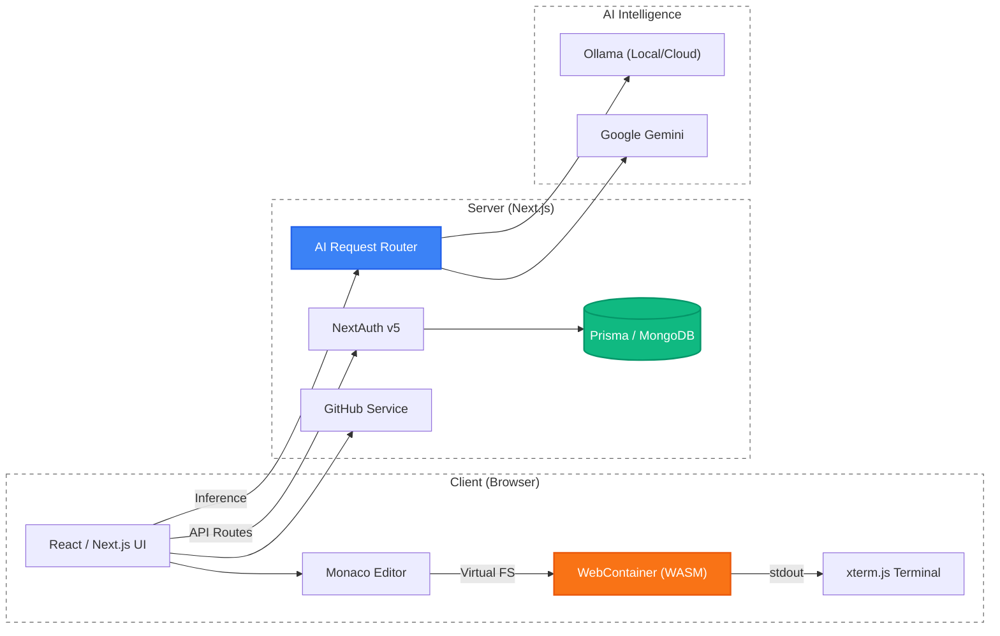

# ☁️ Nimbus — Browser-Native Code Execution Environment with AI-Assisted Development

> **A cloud-based IDE that leverages WebAssembly-sandboxed containers to enable full Node.js execution entirely within the browser, augmented by multi-model AI assistance for real-time code generation and completion.**

[](LICENSE)
[](https://nextjs.org/)
[](https://www.typescriptlang.org/)
[](https://webcontainers.io/)

## Abstract

Modern software development increasingly demands accessible, low-latency execution environments that reduce infrastructure overhead. Traditional cloud IDEs rely on remote server provisioning, introducing latency, cost, and scalability constraints. **Nimbus** presents an alternative architecture: a fully browser-native integrated development environment that executes Node.js workloads inside WebAssembly-based sandboxed containers (WebContainers), eliminating the need for any remote compute infrastructure for code execution.

The system further integrates a hybrid AI assistance pipeline, routing inference requests between local (on-device via Ollama) and cloud-hosted large language models (LLMs) for real-time code completion and conversational debugging. This dual-execution model — browser-native runtime combined with flexible AI routing — demonstrates a viable path toward serverless, privacy-preserving developer tooling.

---

## Motivation & Problem Statement

Cloud-based IDEs have become essential for rapid prototyping, education, and collaborative development. However, existing solutions face fundamental trade-offs:

| Challenge | Traditional Cloud IDE | Nimbus Approach |
|---|---|---|
| **Server dependency** | Requires provisioned VMs/containers | Zero-server: execution runs entirely in-browser via WebAssembly |
| **Latency** | Network round-trip for every execution | Sub-second local execution within the browser sandbox |
| **Cost** | Per-user compute costs scale linearly | Client-side execution — no per-user server cost |
| **Privacy** | Source code transmitted to remote servers | Code never leaves the user's browser |
| **AI integration** | Typically cloud-only, vendor-locked | Hybrid local/cloud model routing with user choice |
| **Setup friction** | Complex environment configuration | One-click framework templates with instant boot |

Nimbus addresses these by combining **client-side sandboxed execution** with **configurable AI assistance**, creating a development environment that is simultaneously powerful, private, and cost-efficient.

---

## Key Research Contributions

1. **Zero-Server Execution Architecture** — Implementation of a complete Node.js runtime within the browser using WebContainers (WebAssembly-based OS-level virtualization), including file system management, process spawning, and development server hosting.

2. **Singleton Container Lifecycle Management** — A resilient WebContainer boot strategy using a global singleton pattern with debounced teardown, specifically designed to handle React Strict Mode's double-mount/unmount cycles without container corruption.

3. **Hybrid AI Inference Pipeline** — A request-routing architecture that dynamically proxies AI inference between local Ollama instances and cloud-hosted models, enabling privacy-first development with optional cloud fallback.

4. **Recursive Repository Materialization** — A GitHub repository import pipeline that fetches, decompresses (via JSZip), and recursively transforms arbitrary repository structures into the system's internal JSON-based file tree representation, with intelligent lockfile exclusion for WebContainer compatibility.

5. **Multi-Framework Template System** — A template abstraction layer supporting instant project bootstrapping across 6+ frameworks (React, Next.js, Vue, Angular, Express, Hono) with pre-configured build toolchains.

---

## System Architecture



> For detailed architecture diagrams including sequence flows and data models, see [`docs/research/system-design.md`](docs/research/system-design.md).

---

## Tech Stack

| Layer | Technology | Purpose |
|---|---|---|
| **Framework** | [Next.js 16](https://nextjs.org/) (App Router) | Server/client rendering, API routes, server actions |
| **Language** | [TypeScript 5](https://www.typescriptlang.org/) | Type-safe application logic |
| **Runtime** | [WebContainers 1.6](https://webcontainers.io/) | In-browser Node.js execution via WebAssembly |
| **Editor** | [Monaco Editor](https://microsoft.github.io/monaco-editor/) | VS Code-grade code editing |
| **AI** | [Ollama](https://ollama.com/) + [Google Generative AI](https://ai.google.dev/) | Local & cloud LLM inference |
| **Database** | [MongoDB](https://www.mongodb.com/) via [Prisma ORM](https://www.prisma.io/) | User data, projects, templates |
| **Auth** | [NextAuth v5](https://authjs.dev/) | OAuth (GitHub, Google), session management |
| **State** | [Zustand](https://github.com/pmndrs/zustand) | Client-side state management |
| **UI** | [Tailwind CSS](https://tailwindcss.com/) + [Radix UI](https://www.radix-ui.com/) | Accessible, themeable component library |
| **Terminal** | [xterm.js](https://xtermjs.org/) | In-browser terminal emulation |

---

## Getting Started

### Prerequisites

- **Node.js** ≥ 18
- **Ollama** (for AI features) — [Download](https://ollama.com)
- **MongoDB** instance (local or Atlas)

### Quick Start

```bash
# Clone & install
git clone https://github.com/ArunSingh-07/Nimbus.git
cd Nimbus
npm install

# Configure environment
cp .env.example .env.local
# Edit .env.local with your MongoDB URL, Ollama URLs, and OAuth credentials
# See docs/setup.md for detailed configuration

# Run development server
npm run dev
```

Open [http://localhost:3000](http://localhost:3000) to access the IDE.

---

## Documentation

### User & Developer Guides

| Document | Description |
|---|---|
| [Setup Guide](docs/setup.md) | Installation, prerequisites, environment configuration |
| [Features Guide](docs/features.md) | AI chat, code completion, playground, multi-model support |
| [Architecture](docs/architecture.md) | Technical overview of system components |
| [Troubleshooting](docs/troubleshooting.md) | Common errors and debugging procedures |

### Research Documentation

| Document | Description |
|---|---|
| [Technical Report](docs/research/technical-report.md) | Full research-style report with background, design, and evaluation |
| [System Design](docs/research/system-design.md) | Architecture diagrams, sequence flows, data models |
| [Evaluation](docs/research/evaluation.md) | Benchmarking methodology, performance analysis, comparison |
| [Related Work](docs/research/related-work.md) | Survey of browser-based IDEs, cloud IDEs, and AI dev tools |
| [Future Work](docs/research/future-work.md) | Research roadmap and extension directions |

---

## Related Work

Nimbus builds upon and differentiates from several categories of existing systems:

- **Browser-based IDEs**: [StackBlitz](https://stackblitz.com/) pioneered WebContainer-based execution; [CodeSandbox](https://codesandbox.io/) uses micro-VMs. Nimbus extends this paradigm with integrated multi-model AI assistance.
- **Cloud IDEs**: [GitHub Codespaces](https://github.com/features/codespaces), [Gitpod](https://www.gitpod.io/), and [AWS Cloud9](https://aws.amazon.com/cloud9/) rely on remote container provisioning. Nimbus eliminates this server dependency entirely.
- **AI-Assisted Development**: [GitHub Copilot](https://github.com/features/copilot) and [Cursor](https://cursor.sh/) provide AI code completion but are tightly coupled to specific editors and cloud services. Nimbus offers model-agnostic, privacy-preserving AI through configurable local/cloud routing.

> For a comprehensive survey, see [`docs/research/related-work.md`](docs/research/related-work.md).

---

## Roadmap

Active development priorities for upcoming releases:

| Status | Feature | Description |
|---|---|---|
| 🔧 In Progress | **Multi-Language Compiler Support** | Integrate language-specific compilers (Python, C/C++, Java) beyond Node.js, enabling polyglot development within the browser sandbox |
| 📋 Planned | **Guest Mode** | Allow unauthenticated users to use the IDE for limited sessions with project data persisted in browser `localStorage`, lowering the barrier to entry |
| 📋 Planned | **Desktop Application (Tauri)** | Package Nimbus as a native desktop application using [Tauri](https://tauri.app/), combining the browser-based architecture with native OS integration and offline access |
| 📋 Planned | **Private Repository Import** | Extend GitHub import to support authenticated private repository access using stored OAuth tokens, complementing the existing public repo import pipeline |

---

## Future Research Directions

- **Collaborative Editing** — Real-time multi-user editing via CRDTs (Conflict-free Replicated Data Types)
- **Language Server Protocol (LSP)** — Full LSP integration within the WebContainer for advanced IDE features
- **WebGPU-Accelerated Inference** — Client-side LLM inference using WebGPU for zero-network-latency AI assistance
- **Multi-Language Runtimes** — Extending beyond Node.js to Python, Rust, and Go via additional WASM runtimes
- **Formal Security Analysis** — Rigorous analysis of the WebContainer sandboxing boundary

> For detailed research directions, see [`docs/research/future-work.md`](docs/research/future-work.md).

---

## Author

**Arun Singh**  
B.Tech, Computer Science and Engineering — Bharati Vidyapeeth's College of Engineering, New Delhi  
📧 [arunsinghjobss@gmail.com](mailto:arunsinghjobss@gmail.com)  
🔗 [GitHub](https://github.com/ArunSingh-07) · [Portfolio](https://arunsingh-07.github.io/)

---

## Citation

If you reference this work in academic contexts, please cite:

```
Arun Singh. "Nimbus: A Browser-Native Code Execution Environment with AI-Assisted Development."
GitHub Repository, 2025. https://github.com/ArunSingh-07/Nimbus
```

---

## License

This project is licensed under the MIT License — see the [LICENSE](LICENSE) file for details.
