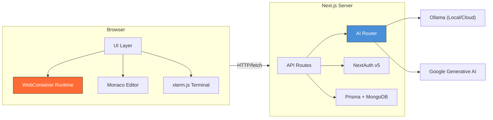

# Architecture — Nimbus

> Technical overview of the Nimbus system architecture. For detailed diagrams, see [`research/system-design.md`](research/system-design.md).

---

## Overview

Nimbus follows a **layered architecture** built on Next.js 16 (App Router), separating concerns into four distinct layers:

1. **Browser Runtime Layer** — WebContainer (WASM), virtual file system, process management
2. **UI Layer** — React components, Monaco Editor, xterm.js terminal, resizable panels
3. **API Layer** — Next.js API routes, server actions, AI request routing
4. **Data Layer** — Prisma ORM, MongoDB, user/project persistence

---

## Frontend

### State Management
- **`ModelContext`** (`components/model-context.tsx`): Stores available AI models and selected model. Syncs across chat sidebar and playground header.
- **`useFileExplorer`** (Zustand store): Manages file tree, open tabs, active file, and unsaved changes. Supports `getState()` for access outside React components.

### Chat
- **`AiChatSidebarPanel`** (`modules/ai-chat/components/ai-chat-sidebarpanel.tsx`): Handles chat UI, message history, streaming responses, and model selection.

### Playground
- **`MainPlaygroundPage`** (`app/playground/[id]/page.tsx`): Orchestrates file explorer, editor, preview, terminal, and AI features in a resizable panel layout.
- **`useWebContainer`** (`modules/webcontainers/hooks/useWebcontainer.ts`): Manages the in-browser Node.js runtime with singleton lifecycle, debounced teardown, and file system operations.
- **`useAISuggestion`** (`modules/playground/hooks/useAISuggestion.tsx`): Triggers code completion requests on typing pauses, rendering as Monaco ghost text decorations.

### Key Design Decision: Singleton WebContainer
The WebContainer API only allows one instance per page. React 18+ Strict Mode unmounts and remounts components during development. Our solution uses a **global singleton promise** with a **500ms debounced teardown** to prevent double-boot while ensuring proper cleanup on actual navigation.

---

## Backend API

The API layer acts as a secure proxy/router for AI requests and a CRUD interface for project data.

### `/api/models`
- **Purpose**: Aggregates available models from all configured AI sources.
- **Logic**: Fetches model tags from `OLLAMA_LOCAL_URL` and `OLLAMA_CLOUD_URL`, merges with source labels (`local`/`cloud`).

### `/api/chat`
- **Purpose**: Handles conversational AI requests.
- **Logic**: Routes requests to the appropriate Ollama URL based on `source` parameter. Streams responses back to the client.

### `/api/code-completion`
- **Purpose**: Generates inline code suggestions.
- **Logic**: Receives prompt with model/source, routes to correct Ollama instance, returns generated text.

### `/api/github/repos`
- **Purpose**: Lists user's GitHub repositories securely.
- **Logic**: Retrieves stored OAuth `access_token` server-side, fetches from GitHub API, returns simplified list. Token never exposed to client.

### Server Actions
- **`importGithubProject`**: Downloads GitHub repos as zipballs, parses via JSZip, filters lockfiles, constructs internal file tree, creates Playground + TemplateFile records.

---

## Data Model

| Model | Purpose |
|---|---|
| `User` | Identity, role (ADMIN/USER/PREMIUM_USER), editor preferences |
| `Account` | OAuth provider accounts (GitHub, Google) |
| `Playground` | Project container with template type |
| `TemplateFile` | JSON-serialized recursive file tree |
| `ChatMessage` | AI conversation history |
| `StarMark` | User bookmarks for projects |
| `LoginHistory` | Security audit trail |

> For full ER diagram, see [`research/system-design.md`](research/system-design.md#6-data-model-entity-relationship).

---

## Further Reading

- [Technical Report](research/technical-report.md) — Full research-style report
- [System Design](research/system-design.md) — Detailed diagrams and sequence flows
- [Evaluation](research/evaluation.md) — Benchmarking and comparison
