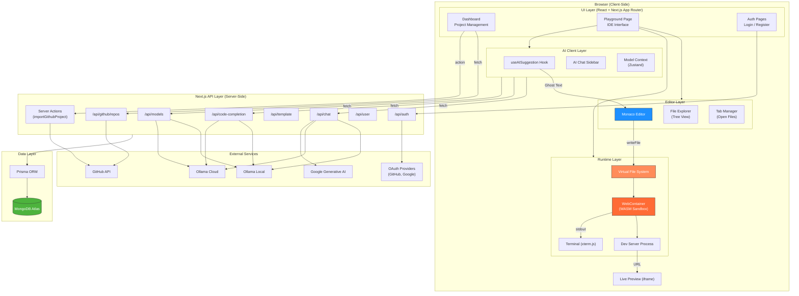
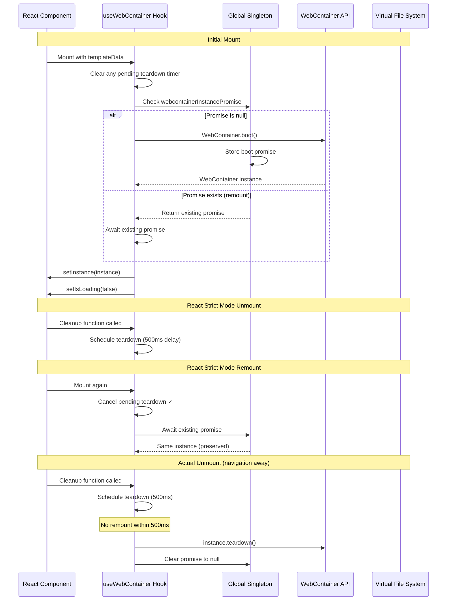
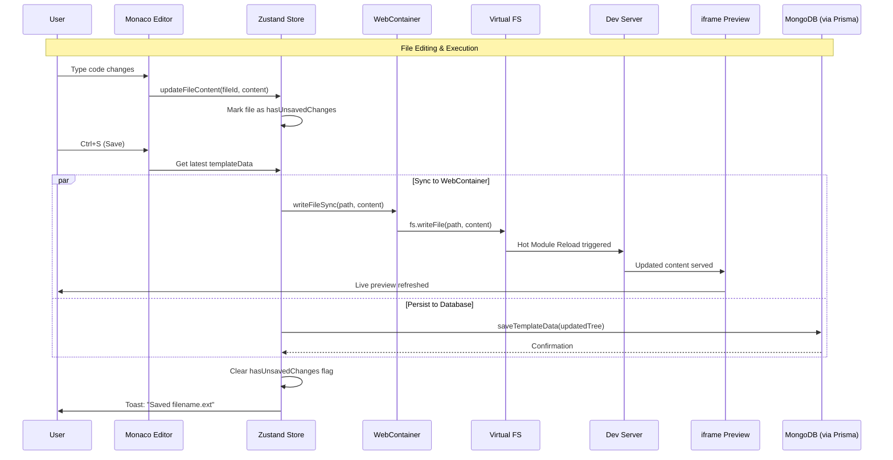
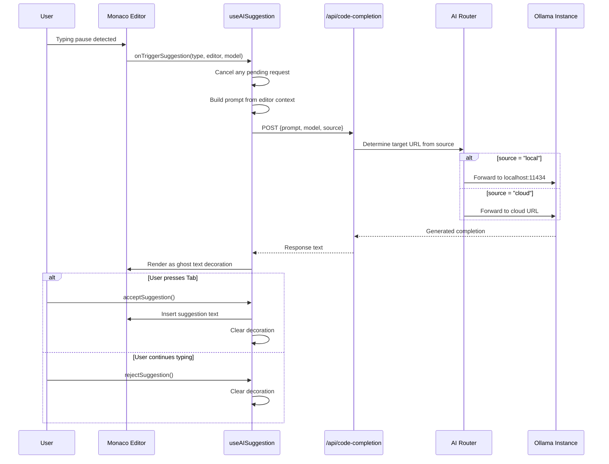
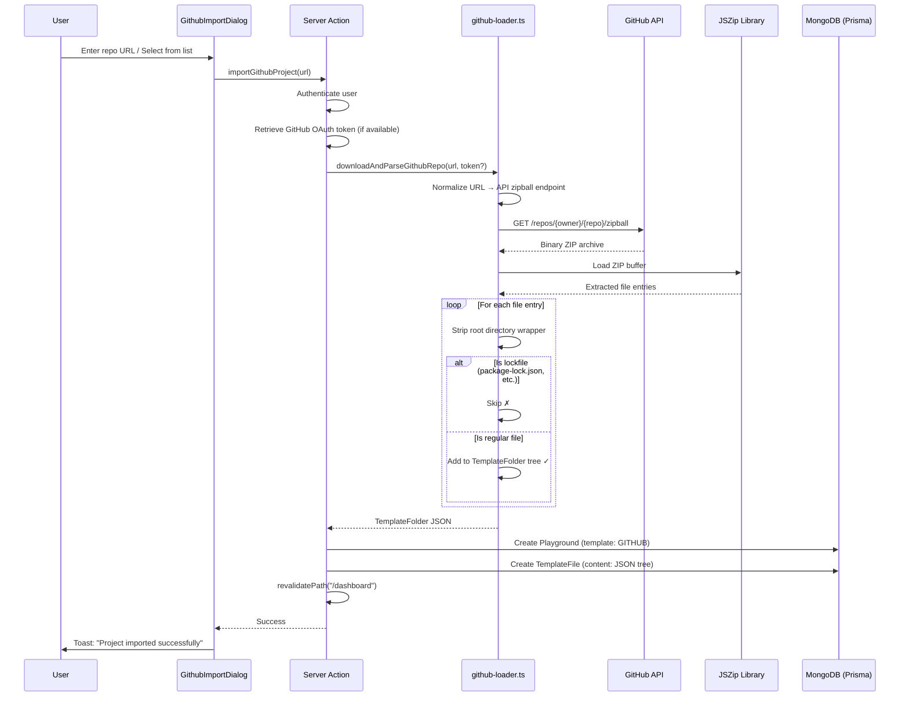
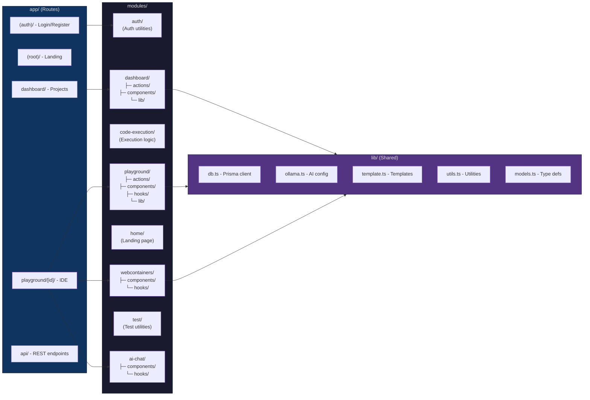
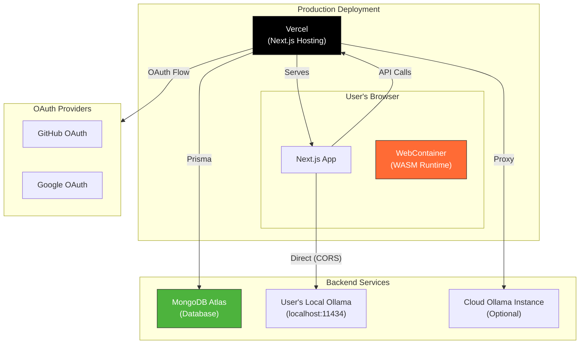

# System Design — Nimbus

> Detailed architecture documentation with diagrams illustrating component interactions, data flows, and system boundaries.

---

## 1. High-Level Architecture



---

## 2. WebContainer Boot Sequence



---

## 3. Code Execution Flow



---

## 4. AI Completion Pipeline



---

## 5. GitHub Repository Import Flow



---

## 6. Data Model (Entity Relationship)

```mermaid
erDiagram
    User ||--o{ Account : "has"
    User ||--o{ Playground : "owns"
    User ||--o{ StarMark : "stars"
    User ||--o{ ChatMessage : "sends"
    User ||--o{ LoginHistory : "has"
    Playground ||--o{ StarMark : "starred by"
    Playground ||--|| TemplateFile : "contains"
    
    User {
        string id PK
        string name
        string email UK
        string image
        UserRole role
        string editorTheme
        string editorFont
        boolean useColoredIcons
        datetime createdAt
        datetime updatedAt
    }
    
    Account {
        string id PK
        string userId FK
        string type
        string provider
        string providerAccountId
        string accessToken
        string refreshToken
    }
    
    Playground {
        string id PK
        string title
        string description
        Templates template
        string userId FK
        datetime createdAt
        datetime updatedAt
    }
    
    TemplateFile {
        string id PK
        json content
        string playgroundId FK_UK
        datetime createdAt
        datetime updatedAt
    }
    
    ChatMessage {
        string id PK
        string userId FK
        string role
        string content
        datetime createdAt
    }
    
    StarMark {
        string id PK
        string userId FK
        string playgroundId FK
        boolean isMarked
        datetime createdAt
    }
    
    LoginHistory {
        string id PK
        string userId FK
        string ipAddress
        string userAgent
        string browser
        string os
        string deviceType
        string screenResolution
        string language
        string timezone
        datetime createdAt
    }
```

---

## 7. Module Structure



---

## 8. Deployment Architecture


